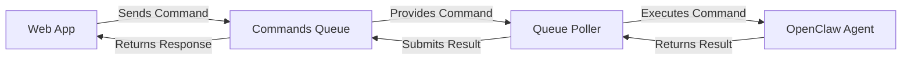

```mermaid
flowchart LR
    A[Web App] -->|Sends Command| B[Commands Queue]
    B -->|Provides Command| C[Queue Poller]
    C -->|Executes Command| D[OpenClaw Agent]
    
    D -->|Returns Result| C
    C -->|Submits Result| B
    B -->|Returns Response| A
```

## How to run locally

```bash
cd commands-queue
./run-queue.sh

cd webapp
./run-webapp.sh

cd queue-poller
./run-poller.sh
```

Then open http://localhost:8080/ to start sending commands.
